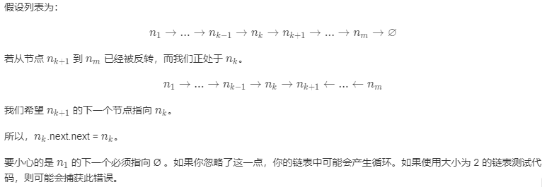

## 每周算法 - 2

> 206.反转链表 —— LeetCode

### 信息卡片

- 时间： 2019-11-18
- 题目链接：https://leetcode-cn.com/problems/reverse-linked-list
- tag：
    - math
    
题目描述：

反转一个单链表。

示例:
```
输入: 1->2->3->4->5->NULL
输出: 5->4->3->2->1->NULL
```


### 参考答案
方法一：迭代

假设存在链表 1 → 2 → 3 → Ø，我们想要把它改成 Ø ← 1 ← 2 ← 3。

在遍历列表时，将当前节点的 next 指针改为指向前一个元素。由于节点没有引用其上一个节点，因此必须事先存储其前一个元素。在更改引用之前，还需要另一个指针来存储下一个节点。不要忘记在最后返回新的头引用！

复杂度分析

- 时间复杂度：O(n)，假设 n 是列表的长度，时间复杂度是 O(n)。
- 空间复杂度：O(1)。

```java
class Solution {
    public ListNode reverseList(ListNode head) {
        ListNode prev = null;
        ListNode curr = head;

        while (curr != null) {
            ListNode nextTemp = curr.next;
            curr.next = prev;
            prev = curr;
            curr = nextTemp;
        }

        return prev;
    }
}

```


方法二：递归

递归版本稍微复杂一些，其关键在于反向工作。假设列表的其余部分已经被反转，现在我该如何反转它前面的部分？



复杂度分析

- 时间复杂度：O(n)，假设 n 是列表的长度，那么时间复杂度为 O(n)。
- 空间复杂度：O(n)，由于使用递归，将会使用隐式栈空间。递归深度可能会达到 n 层。

```java
class Solution {
    public ListNode reverseList(ListNode head) {
        if ((head == null) || (head.next == null)) {
            return head;
        }

        ListNode p = reverseList(head.next);
        head.next.next = head;
        head.next = null;

        return p;
    }
}

```


- 作者：LeetCode
- 链接：https://leetcode-cn.com/problems/reverse-linked-list/solution/fan-zhuan-lian-biao-by-leetcode/

### 其他优秀解答

@wangxun-Jack 

```java
/**
*链表
*@author Administrator
* 
*@param
*/
public class Link {
    public class Node {
        /*
        * 当前节点
        */
        private T value;
        /*
        * 指针
        */
        private Node next;
    
        public Node(T value, Node next) {
            this.value = value;
            this.next = next;
        }
    
        public Node(T value) {
            this.value = value;
            this.next = null;
        }
    }
    
    private Node head;//头节点
    private int size;//节点数量
    
    //链表初始化
    public Link() {
        this.head = null;
        this.size = 0;
    }
    //获得头节点
    public Node getHead(){
        return this.head;
    }
    /**
    *
    *插入头节点
    *@param value 插入元素
    */
     public void addFirst(T value) {
        Node node = new Node(value);
        node.next = head;
        this.head = node;
        this.size++;
     }
     /*
     *中间插入节点
     *@param value 插入元素
     *@param args 插入位置的下标
     */
     public void addNode(T value, int args) {
         if ((args < 0) && (args > size)) {
             throw new IllegalArgumentException();
         }
 
         if (args == 0) {
             this.addFirst(value);
         } else {
             Node preNode = head;
 
             //从第二个节点开始遍历
             for (int i = 0; i < (args - 1); i++) {
                 preNode = preNode.next;
             }
 
             Node node = new Node(value);
             //连接插入的节点
             node.next = preNode.next;
             preNode.next = node;
             this.size++;
         }
     }
     /**
     *
     *插入尾节点
     *@param value 插入元素
     */
     public void addTail(T value){
        addNode(value,this.size);
     }
     /**
     *
     *删除节点
     *
     *@param args 删除元素下标
     */
     public void deleteNode(int args) {
         Node headNode = head;
         Node selfNode = head;
 
         if (0 == args) {
             head = head.next;
         } else {
             for (int i = 0; i < args; i++) {
                 headNode = selfNode;
                 selfNode = selfNode.next;
             }
 
             headNode.next = selfNode.next;
         }
 
         this.size--;
     }
     /*
     *打印链表
     */
      public void printLink() {
         Node node = head;
 
         while (null != node) {
             System.out.println(node.value);
             node = node.next;
         }
     }
     /**
     *
     *反向打印链表
     *
     *@param node
     */
     public void reversePrint(Node node) {
         if ((null != node) && (null != node.next)) {
             reversePrint(node.next);
         }
 
         System.out.println(node.value);
     }
     /**
     *
     *测试
     *
     *@param args
     */
     public static void main(String[] args) {
         Link link = new Link();
         link.addFirst(1);
         link.addTail(3);
         link.addNode(2, 1);
         link.addTail(4);
         link.deleteNode(1);
         link.addNode(0, 0);
         link.addTail(5);
         System.out.println("——顺序输出.——");
         System.out.println();
         link.printLink();
         System.out.println("——逆序序输出.——");
         link.reversePrint(link.getHead());
     }
}

```

@muggleCY

JavaScript似乎没有特定的链表定义，大多数情况似乎都是数组解决的，所以这边稍微查了一下
1.递归方法 （因为不能用全局 所以写了两个函数）
```javascript
 /**
 * Definition for singly-linked list.
 * function ListNode(val) {
 *     this.val = val;
 *     this.next = null;
 * }
 */
/**
 * @param {ListNode} head
 * @return {ListNode}
 */
var reverseList = function(head) {
    p = head;
    var q = null;
    return r(p,q)
};
var r = function(p,q){
    if(p == null){
        return q;
    }else{
        return r(p.next,{val:p.val,next:q})
    }
}
```
2.迭代方法没怎么了解过（好像是把取到的next放在head前面）
```javascript
var reverseList = function(head) {
    let p = head;
    if(head != null){
        while(p.next != null){
            temp = p.next;
            p.next = p.next.next;
            temp.next = head;
            head = temp;
        }
    }
    return head;
};
```

