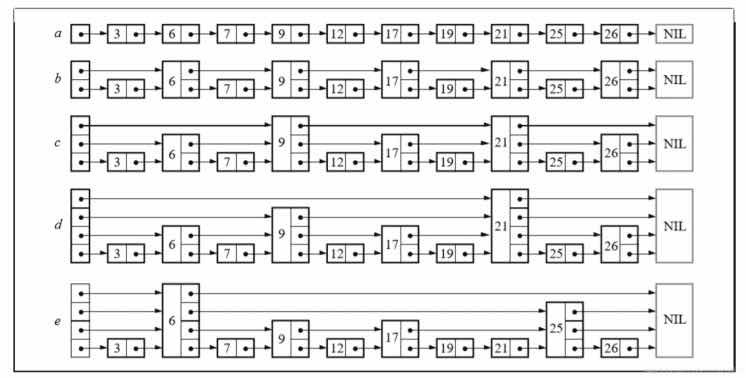

# 2021年3月上半月刊

### 前言

《技术半月刊》从2021年3月10日发刊，每半月更新一次，以问答的形势呈现

问题内容由小熊网上搜索，由高质量微信群全体成员，每日一问集体回答讨论得出，加入请参考[技术交流群加入方式](https://mp.weixin.qq.com/s/ErQFjJbIsMVGjIRWbQCD1Q)

### 操作系统

#### 并发和并行的理解？

* 并发：在一个时间段中多个程序都启动运行在同一个处理机中，比如线程
* 并行：假设目前A，B两个进程，两个进程分别由不同的 CPU  管理执行，两个进程不抢占 CPU  资源且可以同时运行，这叫做并行。单核CPU是伪并行

#### 线程与进程的优缺点

多线程的优点：

* 更加高效的内存共享。多进程下内存共享不便；
* 较轻的上下文切换。因为不用切换地址空间，CR3寄存器和清空TLB。

多进程的优点：

* 各个进程有自己内存空间，所以具有更强的容错性，不至于一个集成crash导致系统崩溃；
* 具有更好的多核可伸缩性，因为进程将地址空间，页表等进行了隔离，在多核的系统上可伸缩性更强。

#### 如何提升多线程的效率？

答者：彬

1. 使用线程池，减少线程的创建销毁带来的开销
2. 根据不同的线程类型确定线程数量，例如cpu繁琐的，核线比1:2，I/O繁琐的1:1
3. 压测，看具体项目能吃多少线程
4. 在线程数无法减少的情况下，根据物理内存调整jvm堆大小，为线程提供足够内存空间
5. 升级物理机的cpu和内存
6. 单台机极限的情况下，使用集群
7. 最基本的，优化代码，减低复杂度

小熊补充

* 尽量使用线程池，从而不用频繁的创建，销毁线程；
* 减少线程之间的同步和通信；
* 通过Huge Page的方式避免产生大量的缺页异常；
* 避免需要频繁共享写的数据。

### go

#### 线程和协程，有什么区别

答者：记事本

线程有系统调度，协程有运行时调度

而为什么协程可以做到同时创建上万个，是因为go的协程初始化资源是4KB空间，比线程轻量级

网上：

区别在于

1. 一个线程可以多个协程，一个进程也可以单独拥有多个协程。
2. 线程进程都是同步机制，而协程则是异步。
3. 协程能保留上一次调用时的状态，每次过程重入时，就相当于进入上一次调用的状态。
4. 线程是抢占式，而协程是非抢占式的，所以需要用户自己释放使用权来切换到其他协程，因此同一时间其实只有一个协程拥有运行权，相当于单线程的能力。
5. 协程并不是取代线程, 而且抽象于线程之上, 线程是被分割的CPU资源, 协程是组织好的代码流程, 协程需要线程来承载运行, 线程是协程的资源, 但协程不会直接使用线程, 协程直接利用的是执行器(Interceptor), 执行器可以关联任意线程或线程池, 可以使当前线程, UI线程, 或新建新程.。
6. 线程是协程的资源。协程通过Interceptor来间接使用线程这个资源。

协程拥有自己的寄存器上下文和栈。协程调度切换时，将寄存器上下文和栈保存到其他地方，在切回来的时候，恢复先前保存的寄存器上下文和栈。因此：

协程的好处：

1. 无需线程上下文切换的开销
2. 无需原子操作锁定及同步的开销
3. 方便切换控制流，简化编程模型

缺点：

1. 无法利用多核资源：协程的本质是个单线程,它不能同时将 单个CPU 的多个核用上,协程需要和进程配合才能运行在多CPU上.当然我们日常所编写的绝大部分应用都没有这个必要，除非是cpu密集型应用。
2. 进行阻塞（Blocking）操作（如IO时）会阻塞掉整个程序

最佳实践

1. 线程和协程推荐在IO密集型的任务(比如网络调用)中使用，而在CPU密集型的任务中，表现较差。
2. 对于CPU密集型的任务，则需要多个进程，绕开GIL的限制，利用所有可用的CPU核心，提高效率。
3. 所以大并发下的最佳实践就是多进程+协程，既充分利用多核，又充分发挥协程的高效率，可获得极高的性能。

#### go的切片和数组有什么区别

定长声明的是数组，不定长是切片

``` go

var arr1 [3]int = [3]int{1, 2, 3}

var slice1 []int = []int{1, 2, 3}
```

数组拷贝后可以随便改值，不会对原数组有影响，但切片拷贝是引用，修改新切片会同时修改原切片

#### 管道chan是什么

一个 channels 是一个通信机制，它可以让一个 goroutine 通过它给另一个 goroutine 发送值信息，可以理解为一个队列，遵循先入先出的原则，同时在代码级别线程安全

#### 管道比锁快？为什么

go中的chan 是用锁实现的。所以肯定不会比锁块。

### redis

#### zset(sort list) 的数据结构是什么？

zset 有序且唯一，在跳表以空间换时间 以冗余的链表换取效率




#### 为什么要用跳表不用B+树的结构呢？

答者：Shawn

B+树的每个节点可以存储多个关键字，而Redis是 内存中读取数据，不涉及IO，因此使用了跳表

#### lru和ttl，大量过期时会不会阻塞

不会，因为redis是闲时清理，可以设置最高占用cpu，清理是基于概率的，存在部分key总是无法清理的情况在，另外清理key的过程是不会fork子进程

#### 什么时候会fork子进程

rdb 、aof、主从无盘复制方式传输

#### key清理不干净会不会遇到什么业务上的问题，万一用到了会发生什么？通过什么办法解决？

如果是lru的话，假如一个key值在以前都没有被访问到，然而最近一次被访问到了，那么就会认为它是热点数据，会更新ttl，不会被淘汰。

优化的话就增大maxmemory-sample，增加每次lru数据的个数，淘汰起来更精确

在redis>4.0版本，有LFU算法，访问不频繁的优先淘汰就好了

另外redis有三种删除策略

惰性删除，也就是在置换的时候删除

定时删除，固定时间段执行删除操作

定期删除，和定时删除一样，区别会时间期是根据业务来自动取的

另外rdb和aof的持久化策略中，rdb读取时不会读取过期数据，aof有rewrite功能，执行行也不会存过期的策略

太频繁的主动删除对cpu不友好，惰性删除对内存不友好，一旦插入大key，会出现cpu使用高峰

#### bigkey还会出现什么问题？

网络阻塞、redis超时、分片内存不均匀导致某些节点占用内存多

避免bigkey的方法，主要是对 bigkey 进行拆分，拆成多个 key，然后用MGET取回来，再在业务层做合并。

#### 集群模式没有mget命令怎么办？

再加个map存在key列表，然后并行取

#### 众所周知 redis 是单线程的（主要读写 io 操作 寻址等），为什么不设计成多线程的？

Redis的核心是快『基于内存』，主要有以下观点：由『避免了上下文切换和cpu的竞争，更加无需考虑各种锁操作，也不会和mysql一样存在死锁导致的问题』。

因为数据是存储在内存中，内存中的运行非常快，但是如果存在上面的锁，和上下文切换，可能就不会那么快了。

有利于开发人员规范代码，单线程的代码比多核异步更加清晰明了。

#### 单线程虽然有这些好处，但一定会浪费一些多核cpu的性能优势，如果是你设计会怎么考虑？

还得看cpu的频率，如果cpu的频率低，并且访问redis的并发很大，那么单个redis线程分摊到每个cpu上的压力也是非常可观的。（一个线程并不是一直都bind到一个固定的核上面的， 其实这也是常遇到的错误的认知：单个线程就算用多核的机器也是浪费的观念）

虽然redis是单线程，如果有需要可以使用多实例来模拟出多线程或者多进程

### mysql

#### myisam和innodb的区别是什么

答者：狸追

innodb 支持事务和外键，最小锁粒度是行级锁

myisam 不支持事务和外键，最小锁粒度是表级锁，间歇锁

补充

innodb 的索引如果是聚簇索引，叶子节点上保存的是数据和索引，非聚簇索引，节点上保存的是id，而myisam保存的是数据的地址（相当于一个指针）

myisam 的表可以没有索引，innodb一定要有索引

myisam 会保存总行数，innodb是全表扫描

对于大量更新、插入、删除，innodb性能上更好，因为他具备的事务、行级锁、B+树等特点，更安全，因为回滚和崩溃恢复更适合大型应用

经过测试在单进程读的情况下myisam执行速度比innodb更快，但是多进程读的时候就失去优势了

mysql5.5版本之后默认innodb

#### 聚簇索引是什么？二级索引的数据结构是什么？

索引按照数据结构来说主要包含B+树和Hash索引。

聚簇索引：用B+树保存，节点只包含id索引，叶子节点同时保存索引和数据，这种数据和索引在一起的方式就是聚簇索引，有主键使用主键，没有主键就用唯一非空索引代替，如果没有会隐式定义一个主键，一张表只能有一个聚簇索引

非聚簇索引：又称二级索引，保存的是主键id值，这一点和myisam保存的是数据地址是不同的。

### linux

#### 你怎么理解操作系统里的内存碎片，有什么解决办法？

内存碎片通常分为内部碎片和外部碎片：

1. 内部碎片是由于采用固定大小的内存分区，当一个进程不能完全使用分给它的固定内存区域时就会产生内部碎片，通常内部碎片难以完全避免；

2. 外部碎片是由于某些未分配的连续内存区域太小，以至于不能满足任意进程的内存分配请求，从而不能被进程利用的内存区域。

现在普遍采取的内存分配方式是段页式内存分配。将内存分为不同的段，再将每一段分成固定大小的页。通过页表机制，使段内的页可以不必连续处于同一内存区域。

#### 内存使用情况 buff和cache有什么区别？

* 都是为了解决内存和IO设备的读写速度不对等的中间缓存，两个都是内存的一部分
* cached 把读取过的数据保存起来，重新读取的时候命中就不用读磁盘了，如果没有命中就会按频率更新cached
* buffers 把分散的写操作集中起来，缓存要输出到io设备的数据（写一次就存一下硬盘贼耗时间，都是缓冲一会再一起写硬盘）
* 拓展一个shared，是共享内存，可以ipcs来查看

#### 怎么定位进程cpu占用大是哪一个函数导致的？

``` bash

perf top -g -p 246
```


这里推荐


#### 什么是程序的堆空间和栈空间？

回答者：海翔

栈是用来保证程序顺序执行的，后入栈的函数先出，完整记录一个函数（方法）调用从开始到结束所做的一切操作。

堆是用来保存变量和对象的，存储临时数据和部分运行时数据。包括函数调用期间产生的临时变量，程序加载启动时载入的全局变量等等。堆内存的分配，应该是在临时变量第一次被使用时分配，全局静态变量是在类加载时分配。不同的变量有不同的生命周期。而垃圾回收，主要也是针对堆内存空间的调整和释放

栈和堆都有其空间大小。

当递归层级过深时会出现栈溢出异常，就是因为要保存的方法栈超过了栈可保存的最大数量。而堆内存不足时常常会遇到OOM异常，堆内存不足以存放新生成的对象或变量了。

#### 虚拟地址和物理地址有什么区别，程序编译运行后首先申请到的是什么地址？

因为位数代表最大寻址能力，32位最大寻址能力是4G所以超过4g的内存条会造成浪费

我们知道线程是cpu调度的最小单元，进程是资源分配的最小单元，每个进程之间的资源是独立的，互不影响的，这是怎么实现的呢？

每个进程启动的时候会有独立内存空间，称为虚拟内存，启动时为给每个进程维护一个独立的页表做虚拟内存和物理内存的映射

所以不同进程之间的虚拟内存地址可能是相同的，这没关系，最终映射到的是物理内存不是一个

假如不同进程都访问某个系统的库，就不需要加载两遍到物理内存上，只要映射到同一地址范围就可以

用到了再分配这种机制叫内存的惰性加载。

虚拟内存寻址是cpu到一个叫mmu的硬件，物理内存寻址是mmu到内存条，mmu相当于是个外包

所以虚拟内存虽然大，不一定全部都存在映射，之前说的堆栈空间也是在虚拟内存中的

#### Linux 打开文件句柄写入一个文件时，mv这个文件会发生什么

mv操作，目标文件的inode将等于源文件的inode；因此正在写入的文件被mv，数据仍然被写入到mv后的文件里，除非重新open

正在写入的文件被rm后，数据会被写入到系统缓存中，一直会耗尽所有可用的内存

#### 日志归档和清空有哪些方式

归档：logrotate 支持归档和删除长期日志

代码级别可以使用滚动日志组件

如果是手动删除可以使用cat /dev/null > xxx.log

#### 查询linux文件被哪些pid 读写的命令是什么

lsof abc.txt 显示开启文件abc.txt的进程

lsof -i :22 知道22端口现在运行什么程序

lsof -c nsd 显示nsd进程现在打开的文件

lsof -g gid 显示归属gid的进程情况

lsof +d /usr/local/ 显示目录下被进程开启的文件

lsof +D /usr/local/ 同上，但是会搜索目录下的目录，时间较长

lsof -d 4 显示使用fd为4的进程

lsof -i [i] 用以显示符合条件的进程情况

### 最后

如果文中有误，欢迎提pr或者issue，**一旦合并或采纳作为贡献奖励可以联系我直接无门槛**加入[技术交流群](https://mp.weixin.qq.com/s/ErQFjJbIsMVGjIRWbQCD1Q)

我是小熊，关注我，知道更多不知道的技术


