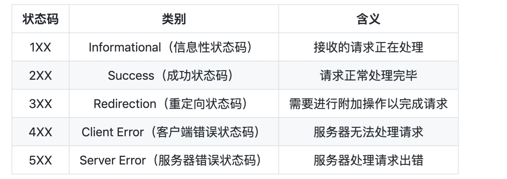

## 计算机网络网络

* IP协议：一种分组交换传输协议；
* TCP协议：一种面向连接，可靠传输的协议；
* UDP协议：一种无连接，不可靠传输的协议。
* 操作系统抽象出Socket接口，每个应用程序需要各自对应到不同的Socket，数据包才能根据Socket正确地发到对应的应用程序
* 一个Socket由IP地址和端口号
* 小于1024的端口属于*特权端口*，需要管理员权限
* 使用Socket进行网络编程时，本质上就是两个进程之间的网络通信
* 服务器端的Socket是指定的IP地址和指定的端口号；客户端的Socket是它所在计算机的IP地址和一个由操作系统分配的随机端口号
* 三次握手
  + TCP客户端最后还要发送一次确认的原因：主要防止已经失效的连接请求报文突然又传送到了服务器，从而产生错误
* 四次挥手
  + A 发送连接释放报文，FIN=1。
  + B 收到之后发出确认，此时 TCP 属于半关闭状态，B 能向 A 发送数据但是 A 不能向 B 发送数据。
  + 当 B 不再需要连接时，发送连接释放报文，FIN=1。
  + A 收到后发出确认，进入 TIME-WAIT 状态，等待 2 MSL（最大报文存活时间）后释放连接。
  + B 收到 A 的确认后释放连接。
* underlay就是底层承载网，overlay就是基于底层网络互联互通的基础加上隧道技术去构建一个虚拟的网络。overlay的核心其实就是打隧道（tunnel）

### http 中的 4层与7层分别代表什么，中间那三层是为了满足什么样的需求呢？

提问：小雨

答者：海翔

* 一个ISO7层模型，一个是web四层模型，不是一个东西
* 7层模型分物理层，数据链路层，网络层，传输层，会话层，表示层，应用层
* 4层模型是TCP/IP协议的定义，数据链路层对应7层模型的物理层+数据链路层，网络层对应7层模型的网络层，传输层对应7层模型的传输层，应用层对应7层模型的会话层+表示层+应用层

### TCP

#### TCP 三次握手、四次挥手（重点）

三次握手：1. 客户端主动，服务端确认客户端发送，服务端接收正常 2 服务端发包，客户端确认全部正常；3. 客户端发包，服务端确认客户端收包，服务端发包正常

四次挥手：某一端发出请求，a1发出终止信号，a2返回确认收到，a2发送终止信号，a1发送确认收到

#### 为什么要有三次握手、四次挥手, 为什么一定要是三次和四次

因为要保证通信的可靠性，握手是三次，保证两端都确认自己和对方的收发包能力，挥手是确认两端都发包结束，可以断开

#### TCP的优点和缺点

优点：可靠、稳定性

缺点：

* 占用系统资源高：建立连接需要耗时, 传递数据时，确认、重传、拥塞
* 易被攻击 ：因为有确认机制，三次握手等机制，容易被人利用，实现DOS 、DDOS攻击

#### 挥手的过程中有timeout的状态，是什么情况

* 超时重传：分为仅重传timeout的包或重传timeout后所有的数据，但都要等待timeout
* 快速重传：数据驱动，发送端每次发包会收到ack 包，如果数据包没有连续到达，就ack最后那个可能被丢了的包，如果发送端连续收到3次相同的ack就重传。缺点是不知道要重传哪些包
* SACK方法：TCP头里加一个SACK的东西，可以精确的知道哪些包到了哪些没到，但比较耗费资源，因为可能要遍历已经传过的资源
* Duplicate-SACK方法：

## HTTP

### URL

* HTTP 使用 URL（ **U** niform **R**esource **L**ocator，统一资源定位符）来定位资源，它是 URI（**U**niform **R**esource **I**dentifier，统一资源标识符）的子集，URL 在 URI 的基础上增加了定位能力。

### HTTP状态码

### 短连接与长连接

当浏览器访问一个包含多张图片的 HTML 页面时，除了请求访问的 HTML 页面资源，还会请求图片资源。如果每进行一次 HTTP 通信就要新建一个 TCP 连接，那么开销会很大。

长连接只需要建立一次 TCP 连接就能进行多次 HTTP 通信。

* 从 HTTP/1.1 开始默认是长连接的，如果要断开连接，需要由客户端或者服务器端提出断开，使用 `Connection : close`；
* 在 HTTP/1.1 之前默认是短连接的，如果需要使用长连接，则使用 `Connection : Keep-Alive`。

### Cookie

Cookie 是服务器发送到用户浏览器并保存在本地的一小块数据，它会在浏览器之后向同一服务器再次发起请求时被携带上，用于告知服务端两个请求是否来自同一浏览器。由于之后每次请求都会需要携带 Cookie 数据，因此会带来额外的性能开销（尤其是在移动环境下）

#### 用途

* 会话状态管理（如用户登录状态、购物车、游戏分数或其它需要记录的信息）
* 个性化设置（如用户自定义设置、主题等）
* 浏览器行为跟踪（如跟踪分析用户行为等）

#### 创建过程

* 服务器发送的响应报文包含 Set-Cookie 首部字段，客户端得到响应报文后把 Cookie 内容保存到浏览器中。
* 客户端之后对同一个服务器发送请求时，会从浏览器中取出 Cookie 信息并通过 Cookie 请求首部字段发送给服务器。

#### 分类

* 会话期 Cookie：浏览器关闭之后它会被自动删除，也就是说它仅在会话期内有效。
* 持久性 Cookie：指定过期时间（Expires）或有效期（max-age）之后就成为了持久性的 Cookie。

### Session

Session 可以存储在服务器上的文件、数据库或者内存中。也可以将 Session 存储在 Redis 这种内存型数据库中，效率会更高。

使用 Session 维护用户登录状态的过程如下：

* 用户进行登录时，用户提交包含用户名和密码的表单，放入 HTTP 请求报文中；
* 服务器验证该用户名和密码，如果正确则把用户信息存储到 Redis 中，它在 Redis 中的 Key 称为 Session ID；
* 服务器返回的响应报文的 Set-Cookie 首部字段包含了这个 Session ID，客户端收到响应报文之后将该 Cookie 值存入浏览器中；
* 客户端之后对同一个服务器进行请求时会包含该 Cookie 值，服务器收到之后提取出 Session ID，从 Redis 中取出用户信息，继续之前的业务操作。

## HTTPS

HTTP 有以下安全性问题：

* 使用明文进行通信，内容可能会被窃听；
* 不验证通信方的身份，通信方的身份有可能遭遇伪装；
* 无法证明报文的完整性，报文有可能遭篡改。

HTTPS 并不是新协议，而是让 HTTP 先和 SSL（Secure Sockets Layer）通信，再由 SSL 和 TCP 通信，也就是说 HTTPS 使用了隧道进行通信。

通过使用 SSL，HTTPS 具有了加密（防窃听）、认证（防伪装）和完整性保护（防篡改）。

### HTTPS 的缺点

* 因为需要进行加密解密等过程，因此速度会更慢；
* 需要支付证书授权的高额费用。
