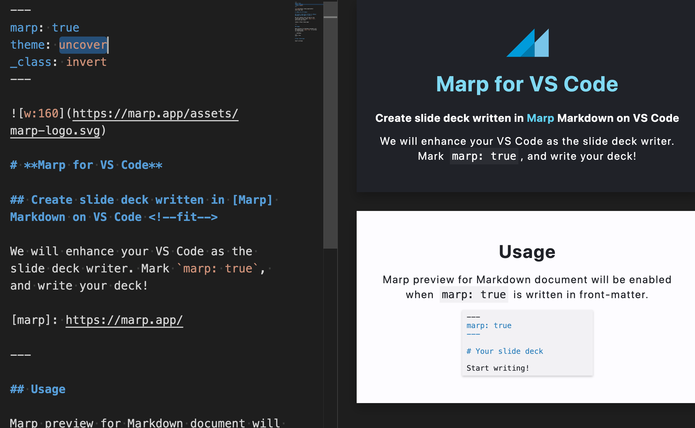
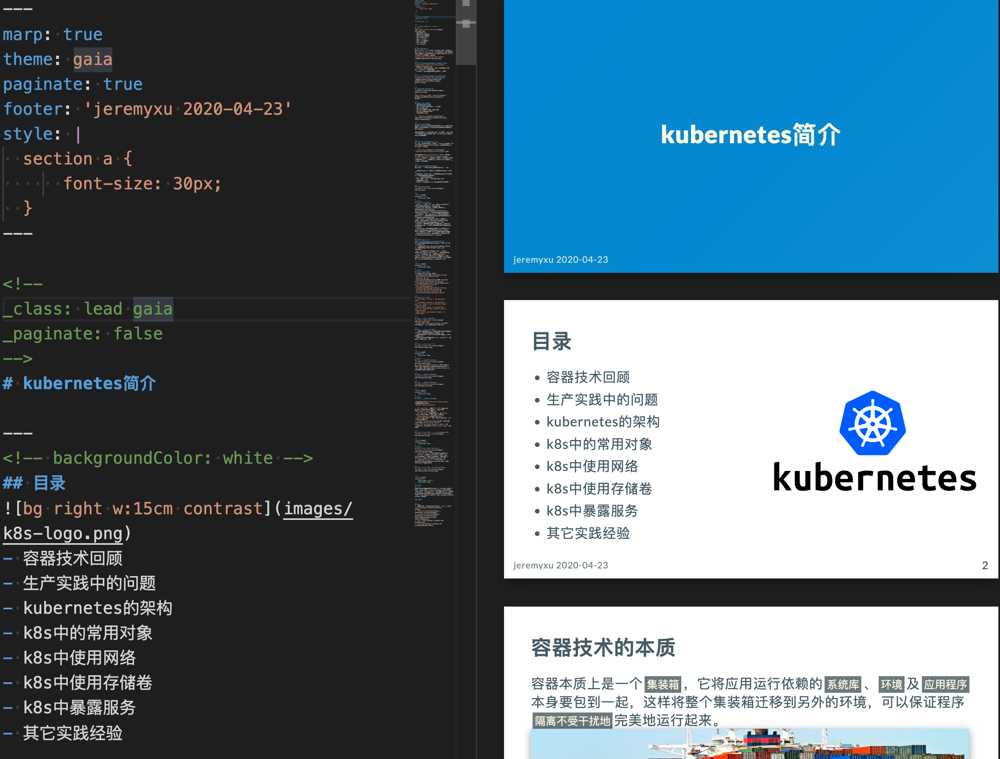
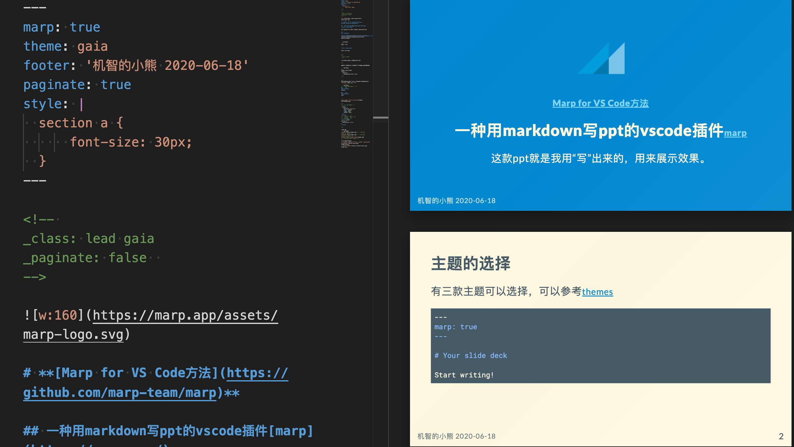
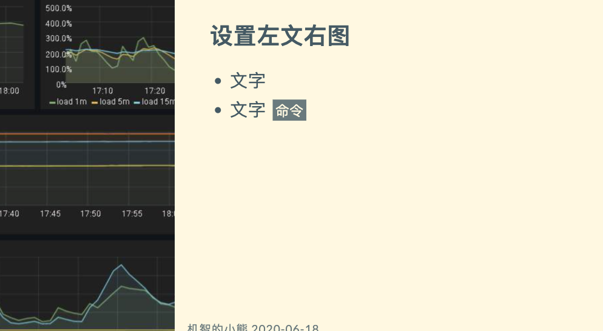
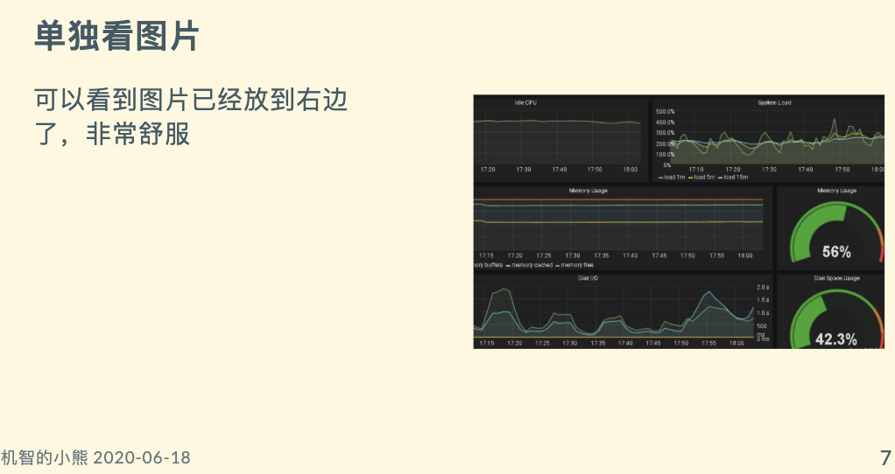
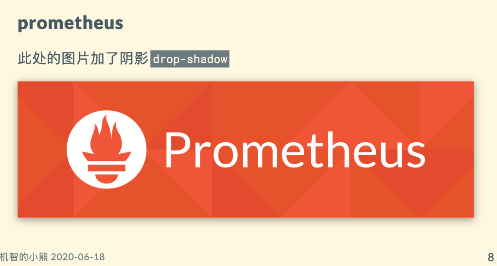

## 一种用markdown写PPT的方法，再也不用费劲排版了

本文原创首发于[一种用markdown写PPT的方法，再也不用费劲排版了](https://coding3min.com/1134.html)

示例:
- 源文件 [example.md](example.md)
- 生成ppt [example.pptx](example.pptx)

### 前言

今天看[jeremyxu 的技术点滴](https://jeremyxu2010.github.io/2020/05/%E6%8A%80%E6%9C%AF%E5%88%86%E4%BA%AB%E4%B9%8B%E5%B7%A5%E5%85%B7%E6%8E%A8%E8%8D%90)，发现分享了一个 `markdown` 写 `PPT` 的插件，惊为天人，先来看看官方效果图。



再看看 jeremyxu 写的效果，我学完了都没学会是怎么写的，直到看了他[项目样例](https://github.com/jeremyxu2010/k8s-share)我才算是真的学会了。



参考[marp 官方文档](https://marpit.marp.app)可以很快学会用法，但是用的时候去翻比较麻烦，我提炼了常用的语法，最后做了一个 PPT 练手，才算是学会了，现在分享出来以便以后翻阅。

### marp 是个什么？

日常工作生活中常常会用到 ppt, 但是 ppt 有时候做起来非常浪费时间，如果不用关心排版，可以专注内容自动排版岂不妙哉？

正好 `markdown` 就是解决排版的一种语言，有好心人自发开发了一个做 `ppt` 的利器，只用关注内容，简单分隔一下，稍微改一下样式就可以用了。

### 安装和上手

下载个[VSCode](https://code.visualstudio.com/), 天然支持 `markdown` ，然后在左侧的插件栏中搜索并安装 `Marp for VS Code` 就可以开始了。为了获得更好的 Markdown 编辑体验，大家不妨再安装一个叫做 `Markdown All in One` 的插件。

使用 `Markdown` 输出一份最简单的幻灯片，只需要让编辑器知道两点即可：它是幻灯片（不是文档）以及它该在哪里分页，通过如下代码做到：

``` Markdown
---
marp: true
---
幻灯片1

1. asdf
2. asdf
---
幻灯片2

* asdf
* asdf
```

效果如下


编辑完成后，通过编辑器右上角的 `Marp` 图标按钮就可以调出 `Export slide deck...` 命令并导出幻灯片了。 `Marp` 插件目前支持导出 `HTML` 和 `PDF` 格式，另外可以将首页导出为 `PNG` 或 `JPEG` 格式的图片。

### 优化样式

当然没有漂亮是样式是不行的，好在可以简单设置呈现，为此我专门做了一个 ppt



有三款主题可以选择，可以参考[themes](https://github.com/marp-team/marp-core/tree/master/themes)，有的主题只能居中，我选了一个可居中也可居左的主题。

``` markdown
---
marp: true
theme: gaia
footer: '机智的小熊 2020-06-18'
paginate: true
style: |
  section a {
      font-size: 30px;
  }
---
```

- `footer` 代表是页尾， `header` 代表页首
- `paginate` 是否在右下角标页码
- `style` 自定义全局样式，插件所有的样式参考[官网提供的样式](https://marpit.marp.app/theme-css)

### 首页配置


在当前页面头部，用 `html` 中的注释语法

```Markdown
<!--
_class: lead gaia
_paginate: false
-->
```

- `_class` 当前页面设置 `lead gaia` 样式（居中），如果前面不加下划线会影响所有页面
- `_paginate` 屏蔽右下角页码
- 其他更详细语法参考[官网手册](https://marpit.marp.app/directives)

首页内容如下

``` markdown


# Marp for VS Code方法

## 一种用markdown写ppt的vscode插件marp

这款ppt就是我用“写”出来的，用来展示效果。
```

### 图片设置

#### 更改长宽

``` markdown


```

#### 图片滤镜（Image Filter）

基于 CSS 的 filter 属性，Marp 可以对图片进行一些基于模糊、亮度、对比度等的操作，如：

``` markdown


```

参考[更多 p 图命令](https://marpit.marp.app/image-syntax?id=image-filters)

#### 背景图片

针对幻灯片的背景图片， `Marp` 提供了简单的方式将某张图片设为背景，在方括号中写入 `bg` 即可

``` markdown

```

同时通过在 `bg` 后追加图片的格式属性，如 `[bg fit]` ，可以具体设置背景图片的缩放方式。其中 `cover` 表示充满页面， `fit` 表示拉伸以适应页面， `auto` 为不做缩放使用原图片比例。

其他图片详细语法, 参考[官网文档调整大小、滤镜，图片作背景的布局、尺寸、分割](https://marpit.marp.app/image-syntax)

### 更改布局

#### 背景图片布局


```markdown


```

在其中一张图片后加入属性 `vertical` 将使图片纵向组合。


``` markdown


```

#### 更新图片与文字位置

有时候想左文右图，或者左图右文的布局，可以设置背景图片的位置



参考[更多背景图片文字排版命令](https://marpit.marp.app/image-syntax?id=advanced-backgrounds)

假如你想加一张完整图片做展示，而不是要上面的样式，可以自行调整图片大小实现

``` markdown

```



如果是上下排布的长图就不需要加`bg`了，直接放上去就好了。

``` markdown
### prometheus

此处的图片加阴影`drop-shadow`


```



### 常用语法汇总

- `color: red` 设置字体颜色
- `paginate: true` 显示页码, `_paginate: false` 屏蔽当前页面页码
- 有三款主题可以选择，可以参考[themes](https://github.com/marp-team/marp-core/tree/master/themes)
- [官网提供的样式](https://marpit.marp.app/theme-css)
- [官网提供的语法汇总](https://marpit.marp.app/directives)
- [更多 p 图命令](https://marpit.marp.app/image-syntax?id=image-filters)
- [官网文档调整大小、滤镜，图片作背景的布局、尺寸、分割](https://marpit.marp.app/image-syntax)
- [更多背景图片文字排版命令](https://marpit.marp.app/image-syntax?id=advanced-backgrounds)

### 引用

- [技术分享之工具推荐-jeremyxu](https://jeremyxu2010.github.io/2020/05/%E6%8A%80%E6%9C%AF%E5%88%86%E4%BA%AB%E4%B9%8B%E5%B7%A5%E5%85%B7%E6%8E%A8%E8%8D%90/)
- [marp 官方文档](https://marpit.marp.app)
- [Marp：用 Markdown「写」PPT 的新选择](https://sspai.com/post/55718)
- [官方 github](https://github.com/marp-team/marp)
- [jeremyxu的github样例](https://github.com/jeremyxu2010/k8s-share)
