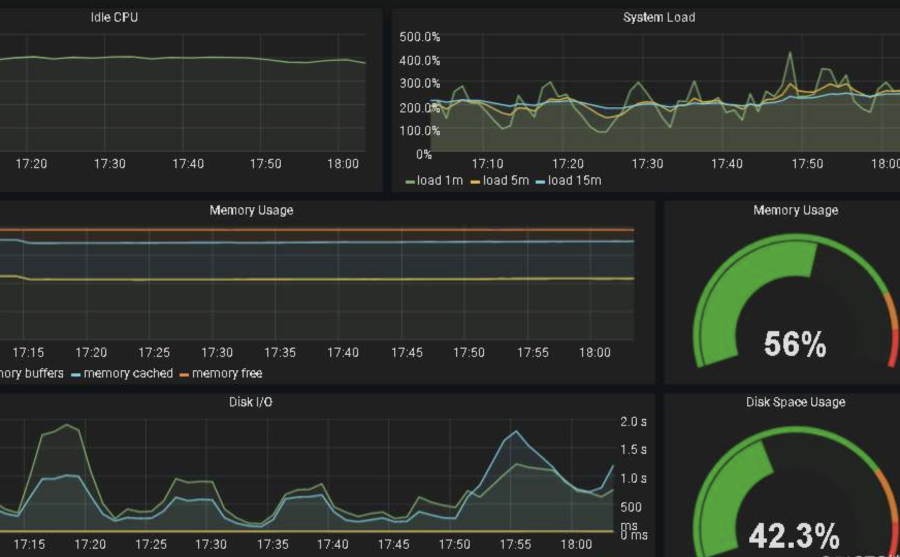

<!-- 
_class: lead gaia
_paginate: false 
backgroundColor: write 
-->

# Marp for VS Code方法

## 一种用markdown写ppt的vscode插件marp
这款ppt就是我用“写”出来的，用来展示效果。

--- 
幻灯片1

1. asdf
2. asdf

---
幻灯片2

* asdf
* asdf

---

### 左中右组合方式

---

### 在其中一张图片后加入属性 `vertical` 将使图片纵向组合。

---

### 设置左图右文

* 文字
* 文字 `命令`
  

--- 

### 单独看图片

可以看到图片已经放到右边了，非常舒服

---

### prometheus

此处的图片加了阴影`drop-shadow`

---

## 引用

* [技术分享之工具推荐-jeremyxu](https://jeremyxu2010.github.io/2020/05/%E6%8A%80%E6%9C%AF%E5%88%86%E4%BA%AB%E4%B9%8B%E5%B7%A5%E5%85%B7%E6%8E%A8%E8%8D%90/)
* [marp官方文档](https://marpit.marp.app)
* [Marp：用 Markdown「写」PPT 的新选择](https://sspai.com/post/55718)
* [官方github](https://github.com/marp-team/marp)

### 谢谢
