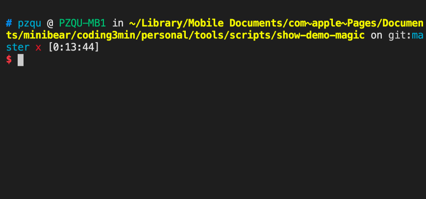

**报错？网卡？演示的时候别再尴尬，试试 demo-magic 假输入命令工具**

本文原创首发于[报错？网卡？演示的时候别再尴尬，试试 demo-magic 假输入命令工具](https://coding3min.com/1153.html)
### 简介

演示的时候要准确的输入很多命令，有时候会遭遇网比较卡，半天没反应，或者命令报错的尴尬，特别在大分享，众多人等待的情况下，只能面对面，干瞪眼。

所以[demo-magic](https://github.com/paxtonhare/demo-magic/) 就是解决这个问题的，他可以模拟你的输入输出，看起来就像现场打字一样，你还可以调整打字速度，可以随时暂定继续，满足演示的需要。

如下图，就是全自动的，我特意让他在下载东西的时候停顿了1秒，在登陆的时候特意等待我按回车。



### 用法

先到[github](https://github.com/paxtonhare/demo-magic)上把`demo-magic.sh`下载下来，放到任意目录里。

我的目录结构

``` other
.
|____tools
| |____demo-magic.sh
|____cache
| |____ls-al-cache.txt
| |____install-pv-cache.txt
|____run.sh
```

* `demo-magic.sh` 就是下载好的脚本
* `cache` 用来保存准备好的输出
* `run.sh` 测试脚本（假演示脚本）

这个工具[用法](https://github.com/paxtonhare/demo-magic/blob/master/samples/demo-template.sh)非常非常简单，简单到一看就会的程度。

``` BASH
#/bin/bash

# include demo-magic
. ./tools/demo-magic.sh -n

# Will wait max 1 seconds until user presses
PROMPT_TIMEOUT=1

TYPE_SPEED=10

# hide the evidence
clear

p "ls -al"
cat cache/ls-al-cache.txt

p "brew install pv"
wait
cat cache/install-pv-cache.txt

# Will wait until user presses enter
PROMPT_TIMEOUT=0
p "ssh 123.123.111.666"
echo password\(ENTER\):
wait
echo login success

```

